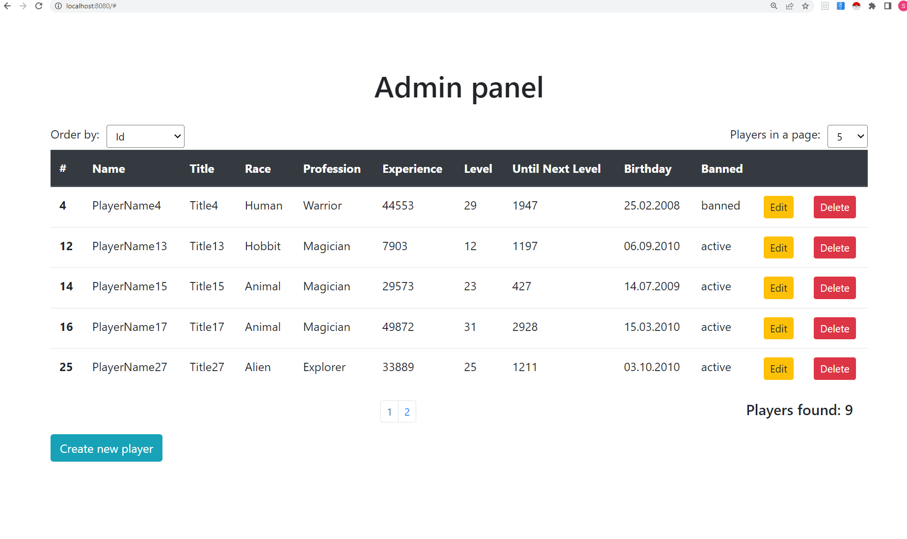
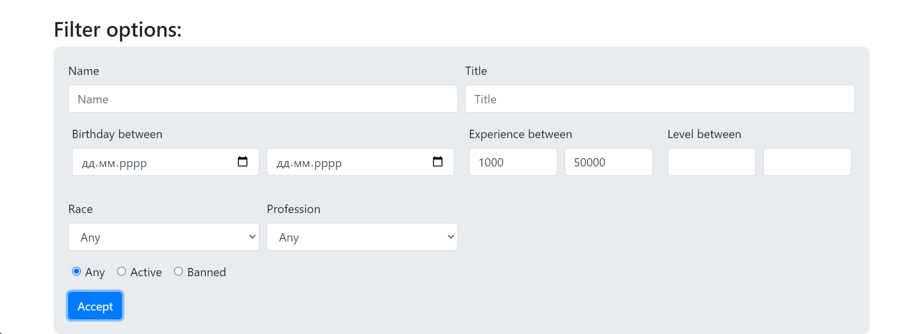
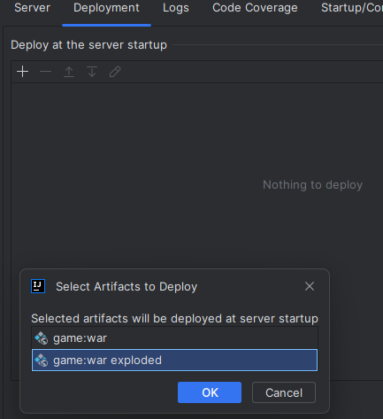

Java Project Game Admin Management
===============================

Used technologies/tools/frameworks Java:
Maven/ Spring/ Tomcat 9/ Spring Data JPA/ REST API/ MySQL/ H2 Database/ 
JUnit/ Bootstrap(CSS)/ plugins.

### How to use the application
- Install MySQL server [MySQL server](https://www.mysql.com/)
- Database account: root
- Database password: 12345
- Database port: 3306
(or configure custom one's in AppConfig file)
- Log in to database (using for instance MySQL Workbench](https://www.mysql.com/products/workbench/))
- Run init.sql (you can find it in root folder)
- Setup Tomcat as application start (if not installed you can download [here](https://tomcat.apache.org/download-90.cgi) /tested until version 9.0.78/)
  
- In the deployment sheet in the "Deploy at the server startup" press "+" and choose Artifact...
- 
- and select game:war exploded

- Then make empty "Application context"

- Ok, now start Tomcat and enjoy the application

####  In the Game Admin Management you can 
1. Get the list of all registered players;
2. Create new player;
3. Edit existed player /all fields excluding Levels/;
4. Delete player;
5. Get the list filtered by different fields;
6. Get the number of filtered players;
7. Sort the list by Name, Experience and Birthday;
8. Choose how many rows will be displayed;
